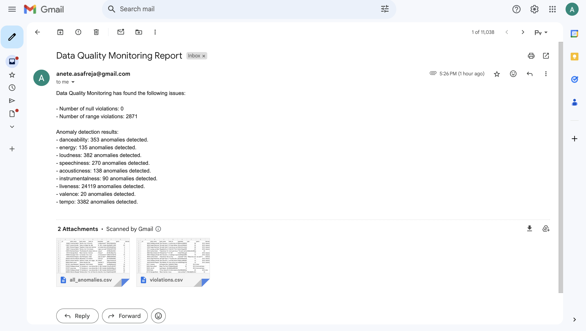

# Data Quality Monitoring

## Overview

The Data Quality Monitoring project is a Python-based solution designed to ensure the integrity and reliability of large datasets using PySpark. This project integrates data validation, anomaly detection, and email notifications into a single script. It has been tested with a large dataset containing 1 million tracks.

## Project Structure

- **`data_quality_monitoring.py`**: The main script that:
  - **Validates Data**: Checks for null values and applies data validation rules.
  - **Detects Anomalies**: Identifies data that falls outside predefined ranges or thresholds.
  - **Sends Email Notifications**: Notifies stakeholders about data quality issues.


## Dataset Description

The project utilizes [Spotify 1 million tracks dataset](https://www.kaggle.com/datasets/amitanshjoshi/spotify-1million-tracks), which is sourced from Kaggle. The dataset can be accessed and downloaded from the Kaggle website. 
This dataset is used to test and validate the data quality monitoring system. Each track in the dataset includes various attributes that provide insights into the track’s characteristics and performance. The large size of the dataset allows for comprehensive data quality checks and anomaly detection, making it suitable for evaluating the robustness of the monitoring process.

The dataset’s extensive coverage ensures that the validation and anomaly detection mechanisms are tested against a diverse range of data points, reflecting real-world data scenarios and challenges.

## Data Quality Monitoring Email Report

### Email Notification Example

Below is a screenshot of the email generated by the Data Quality Monitoring script:




## Steps

1. **Data Validation**:
   - Validates the dataset by checking for null values and applying range-based validation rules for various attributes.

2. **Anomaly Detection**:
   - Detects anomalies in specific columns based on statistical measures (mean and standard deviation). Anomalies are identified as deviations that exceed three standard deviations from the mean.

3. **Email Notification**:
   - Sends an email report to stakeholders summarizing the data quality issues. The email includes attachments of CSV files:
     - **`violations.csv`**: Contains rows with null values or out-of-range values.
     - **`all_anomalies.csv`**: Contains rows with detected anomalies based on statistical thresholds.

### Prerequisites

- Python 3.8 or higher
- PySpark (for data processing)
- Required Python packages: pyspark, pandas, python-dotenv
- Access to an SMTP server for sending emails

## Setting Up Environment Variables

This project uses environment variables to manage configuration settings. To get started, you'll need to create a `.env` file in the root directory of the project with the necessary variables.

### Steps to Configure

1. **Create a `.env` File**

   In the root directory of the project, create a file named `.env`.

2. **Add Environment Variables**

   Add the required environment variables to the `.env` file. Below is an example of the content you should include:

   ```env
    smtp_server=smtp.example.com
    smtp_port=587
    smtp_user=your-email@example.com
    smtp_password=your-email-password


